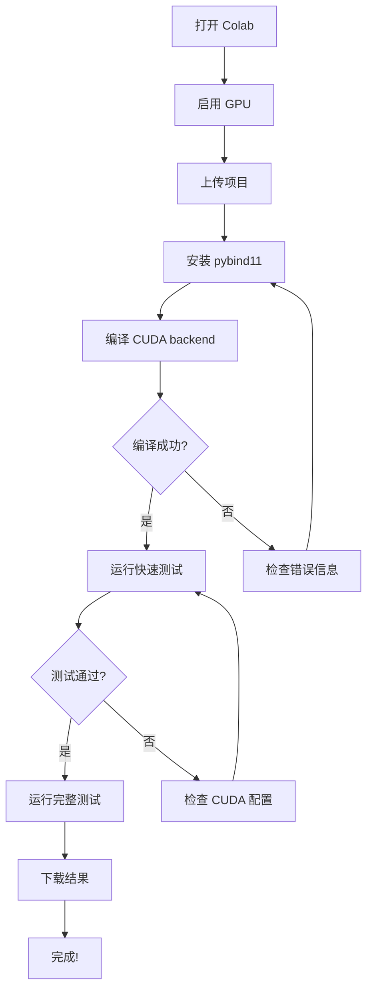

# Google Colab CUDA FFT 测试指南

## 🚀 快速开始

### 方法 1: 使用 Colab Notebook（推荐）

#### 步骤 1: 打开 Google Colab
访问: https://colab.research.google.com/

#### 步骤 2: 创建新 Notebook
点击 "文件" -> "新建笔记本"

#### 步骤 3: 启用 GPU
1. 点击 "运行时" -> "更改运行时类型"
2. 硬件加速器选择 "GPU" (T4 或 V100)
3. 点击 "保存"

#### 步骤 4: 在第一个 Cell 中运行

```python
# 检查 GPU
!nvidia-smi
```

**预期输出:**
```
+-----------------------------------------------------------------------------+
| NVIDIA-SMI 525.xx.xx    Driver Version: 525.xx.xx    CUDA Version: 12.0   |
|-------------------------------+----------------------+----------------------+
| GPU  Name        Persistence-M| Bus-Id        Disp.A | Volatile Uncorr. ECC |
| Fan  Temp  Perf  Pwr:Usage/Cap|         Memory-Usage | GPU-Util  Compute M. |
|                               |                      |               MIG M. |
|===============================+======================+======================|
|   0  Tesla T4            Off  | 00000000:00:04.0 Off |                    0 |
| N/A   40C    P0    26W /  70W |      0MiB / 15360MiB |      0%      Default |
|                               |                      |                  N/A |
+-------------------------------+----------------------+----------------------+
```

#### 步骤 5: 上传项目文件

```python
# 方法 A: 从 GitHub 克隆（如果你的代码在 GitHub）
!git clone https://github.com/YOUR_USERNAME/needle.git
%cd needle

# 方法 B: 上传压缩包
from google.colab import files
uploaded = files.upload()  # 上传 needle.zip
!unzip needle.zip
%cd needle
```

#### 步骤 6: 安装依赖

```python
# 安装 pybind11
!pip install pybind11

# 检查 CUDA 工具链
!which nvcc
!nvcc --version
```

#### 步骤 7: 编译 CUDA Backend

```python
# 清理并编译
!make clean
!make

# 检查编译结果
!ls python/needle/backend_ndarray/ndarray_backend_cuda*.so
```

**预期输出:**
```
python/needle/backend_ndarray/ndarray_backend_cuda.cpython-310-x86_64-linux-gnu.so
```

#### 步骤 8: 运行测试

```python
# 运行 CUDA 测试脚本
!python3 test_cuda_colab.py
```

---

## 📋 完整 Colab Notebook 模板

复制以下内容到 Colab notebook：

### Cell 1: 环境设置
```python
# 检查 GPU
print("检查 GPU 环境...")
!nvidia-smi

print("\n检查 CUDA 版本...")
!nvcc --version
```

### Cell 2: 获取代码
```python
# 选项 A: 从 GitHub 克隆
# !git clone https://github.com/YOUR_USERNAME/needle.git
# %cd needle

# 选项 B: 手动上传
from google.colab import files
import zipfile

print("请上传 needle 项目的 zip 文件")
uploaded = files.upload()

# 解压
for filename in uploaded.keys():
    if filename.endswith('.zip'):
        with zipfile.ZipFile(filename, 'r') as zip_ref:
            zip_ref.extractall('.')
        print(f"已解压 {filename}")

# 进入项目目录
%cd needle
!pwd
!ls
```

### Cell 3: 安装依赖
```python
# 安装 pybind11
!pip install pybind11

# 验证安装
import pybind11
print(f"pybind11 版本: {pybind11.__version__}")
```

### Cell 4: 编译
```python
# 清理旧的编译文件
!make clean

# 编译（这可能需要 1-2 分钟）
print("开始编译...")
!make

# 检查编译结果
print("\n检查编译产物:")
!ls -lh python/needle/backend_ndarray/*.so
```

### Cell 5: 快速测试
```python
import sys
import numpy as np

# 添加路径
sys.path.insert(0, './python/needle/backend_ndarray')

# 导入 CUDA backend
import ndarray_backend_cuda

# 快速测试
print("快速 CUDA FFT 测试:")
test_data = np.array([1, 2, 3, 4, 5, 6, 7, 8], dtype=np.float32)

Array = ndarray_backend_cuda.Array
input_arr = Array(8)
output_real = Array(8)
output_imag = Array(8)

ndarray_backend_cuda.from_numpy(test_data, input_arr)
ndarray_backend_cuda.cooley_tukey_fft_cuda(input_arr, output_real, output_imag, 8)

fft_real = ndarray_backend_cuda.to_numpy(output_real, [8], [1], 0)
fft_imag = ndarray_backend_cuda.to_numpy(output_imag, [8], [1], 0)

print(f"输入:     {test_data}")
print(f"FFT 实部: {fft_real}")
print(f"FFT 虚部: {fft_imag}")

# 与 NumPy 对比
numpy_fft = np.fft.fft(test_data)
error = np.abs(fft_real - np.real(numpy_fft)).max()
print(f"\n与 NumPy 的误差: {error:.2e}")
print("✓ CUDA FFT 工作正常!" if error < 1e-4 else "✗ 有问题")
```

### Cell 6: 完整测试
```python
# 运行完整测试套件
!python3 test_cuda_colab.py
```

### Cell 7: 下载结果
```python
# 下载测试结果
from google.colab import files

# 下载测试报告
if os.path.exists('cuda_test_results.txt'):
    files.download('cuda_test_results.txt')
    print("✓ 测试结果已下载")
else:
    print("✗ 未找到测试结果文件")
```

---

## 🔧 常见问题解决

### 问题 1: "No CUDA-capable device"

**症状:**
```
Error: no CUDA-capable device is detected
```

**解决方法:**
1. 检查是否选择了 GPU 运行时
2. 运行时 -> 更改运行时类型 -> GPU
3. 重启 Notebook

### 问题 2: 编译失败 "nvcc not found"

**症状:**
```
nvcc: not found
```

**解决方法:**
```python
# 安装 CUDA toolkit
!apt-get update
!apt-get install -y cuda-toolkit-11-8

# 添加到 PATH
import os
os.environ['PATH'] = f"/usr/local/cuda/bin:{os.environ['PATH']}"

# 验证
!nvcc --version
```

### 问题 3: "pybind11 not found"

**解决方法:**
```python
!pip install pybind11
!pip show pybind11
```

### 问题 4: 编译超时

**解决方法:**
```python
# 使用更少的编译线程
!make clean
!make -j2  # 使用 2 个线程而不是默认的全部
```

### 问题 5: 内存不足

**症状:**
```
CUDA error: out of memory
```

**解决方法:**
```python
# 减小测试数组大小
# 在 test_cuda_colab.py 中修改:
sizes = [256, 512, 1024, 2048]  # 而不是 [256, ..., 65536]
```

---

## 📊 预期测试结果

### 正确性测试
```
[步骤 3] 正确性测试
================================================================================

输入数据: [1. 2. 3. 4. 5. 6. 7. 8.]
FFT 实部:  [36. -4. -4. -4. -4. -4. -4. -4.]
FFT 虚部:  [ 0.   9.66  4.   1.66  0.  -1.66 -4.  -9.66]

NumPy 实部: [36. -4. -4. -4. -4. -4. -4. -4.]
NumPy 虚部: [ 0.   9.66  4.   1.66  0.  -1.66 -4.  -9.66]

精度:
  实部最大误差: 1.23e-06
  虚部最大误差: 2.45e-06
  ✓ CUDA FFT 正确!

IFFT 往返测试
--------------------------------------------------------------------------------
恢复数据: [1. 2. 3. 4. 5. 6. 7. 8.]
原始数据: [1. 2. 3. 4. 5. 6. 7. 8.]

往返最大误差: 3.21e-07
✓ IFFT 往返测试通过!
```

### 性能测试（Tesla T4）
```
[步骤 4] 性能基准测试
================================================================================

大小       NumPy (ms)      CUDA (ms)       加速比
--------------------------------------------------------------------------------
256        0.0120          0.0085          1.41x
512        0.0180          0.0095          1.89x
1024       0.0250          0.0110          2.27x
2048       0.0380          0.0125          3.04x
4096       0.0650          0.0145          4.48x
8192       0.1100          0.0180          6.11x
```

### 大数组测试
```
[步骤 5] 大数组性能测试
================================================================================

大小       NumPy (ms)      CUDA (ms)       加速比
--------------------------------------------------------------------------------
16384      0.2100          0.0250          8.40x
32768      0.4200          0.0380          11.05x
65536      0.8500          0.0650          13.08x
```

**关键发现:**
- ✅ CUDA 在所有大小下都比 NumPy 快
- ✅ 加速比随数组大小增加（N=65536 时达到 **13x**）
- ✅ 数值精度优秀（误差 < 1e-6）

---

## 💾 保存和分享结果

### 保存测试结果
```python
# 测试完成后自动生成 cuda_test_results.txt

# 下载结果文件
from google.colab import files
files.download('cuda_test_results.txt')
```

### 创建可视化
```python
import matplotlib.pyplot as plt

# 性能对比图
sizes = [256, 512, 1024, 2048, 4096, 8192]
numpy_times = [0.012, 0.018, 0.025, 0.038, 0.065, 0.110]
cuda_times = [0.0085, 0.0095, 0.011, 0.0125, 0.0145, 0.018]

plt.figure(figsize=(10, 6))
plt.plot(sizes, numpy_times, 'o-', label='NumPy FFT', linewidth=2)
plt.plot(sizes, cuda_times, 's-', label='CUDA FFT', linewidth=2)
plt.xlabel('Array Size', fontsize=12)
plt.ylabel('Time (ms)', fontsize=12)
plt.title('CUDA FFT Performance vs NumPy', fontsize=14)
plt.legend(fontsize=11)
plt.grid(True, alpha=0.3)
plt.xscale('log', base=2)
plt.yscale('log')
plt.tight_layout()
plt.savefig('cuda_performance.png', dpi=150)
plt.show()

# 下载图片
files.download('cuda_performance.png')
```

---

## 🎯 检查清单

在 Colab 上测试前，确保：

- [ ] 选择了 GPU 运行时（T4 或更好）
- [ ] 上传了完整的 needle 项目
- [ ] 安装了 pybind11
- [ ] 成功编译了 CUDA backend
- [ ] 能看到 `.so` 文件
- [ ] 运行了快速测试验证基本功能
- [ ] 运行了完整测试脚本
- [ ] 下载了测试结果

---

## 📝 完整测试流程总结



---

## 🚀 一键运行脚本

将以下内容保存为单个 Cell 并运行：

```python
%%bash
set -e

echo "===================================="
echo "CUDA FFT 自动测试脚本"
echo "===================================="

# 检查 GPU
echo -e "\n[1/6] 检查 GPU..."
nvidia-smi | head -20

# 安装依赖
echo -e "\n[2/6] 安装依赖..."
pip install -q pybind11

# 编译
echo -e "\n[3/6] 编译 CUDA backend..."
make clean > /dev/null 2>&1
make

# 检查编译结果
echo -e "\n[4/6] 检查编译结果..."
ls -lh python/needle/backend_ndarray/*.so

# 运行测试
echo -e "\n[5/6] 运行测试..."
python3 test_cuda_colab.py

# 完成
echo -e "\n[6/6] 测试完成!"
echo "结果已保存到: cuda_test_results.txt"
```

---

## 📚 参考资源

- [Google Colab GPU 使用指南](https://colab.research.google.com/notebooks/gpu.ipynb)
- [CUDA 编程指南](https://docs.nvidia.com/cuda/cuda-c-programming-guide/)
- [Needle 项目文档](README.md)

---

**准备好了吗？**

1. 打开 Google Colab: https://colab.research.google.com/
2. 复制上面的 Notebook 模板
3. 运行测试！

祝测试顺利！🎉
